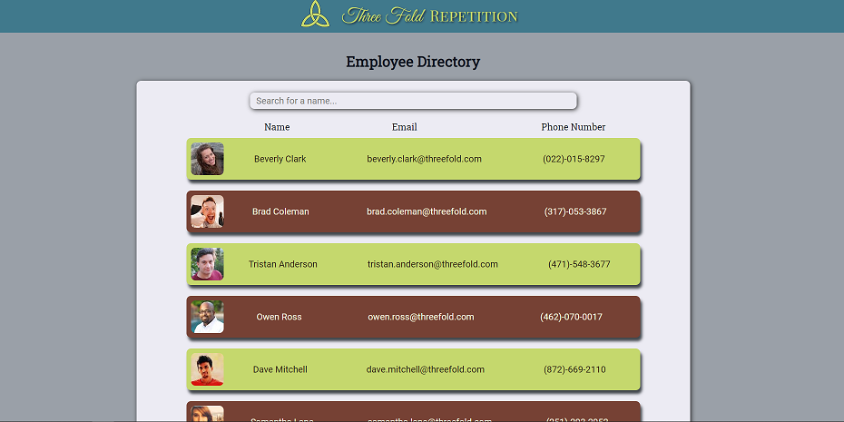

# Three Fold Repetition's Employee Directory

An app for anyone interested in who works for Three Fold Repetition.

## Table of Contents

- [Description](#Description)

- [Usage Guide](#Usage-Guide)

- [Questions and Reporting](#Questions-and-Reporting)

- [License Information](#License-Information)

## Description

Interested in seeing a picture of who you've been emailing or working with over the phone? Or maybe you simply wish to find the contact information of someone you know who works there. Whatever the case, this webpage will show you all of our hardworking employees and their contact info!

This app allows a user to scroll through every employee of Three Fold Repetition, search for a specific employee, or sort employees by name, email address, or phone number. The employee's information is easy to see and use, but you may want to save it somewhere else. Unfortunately, our turnover rate is higher than we'd like.

## Usage Guide

Using this app is as simple as navigating in a browser to https://kirkpatrickpaul.github.io/employee_directory/. After that, it should look like this:

Once there, the user may search for a specific employee, sort ascending or descending over the three fields, or simply scroll through the employee list and enjoy looking at everyone's personal information.

## Questions and Reporting

Okay, the gig is up. Three Fold Repetition is a chess rule, not a company name (that I know of). These employees are all computer generated from the Random User Generator API. This app was an assignement to help me learn React, classes, and functional programming. I do not forsee updating this at any time, as it is perfect just the way it is. Except the ascending and descending carets. Those things are impossible to get working, apparently. If, for some reason, you are using my app and run into problems, feel free to contact me through [my github](https://kirkpatrickpaul.github.io/contact.html).

## Liscence Information

For the Employee Directory, I use the MIT license.
